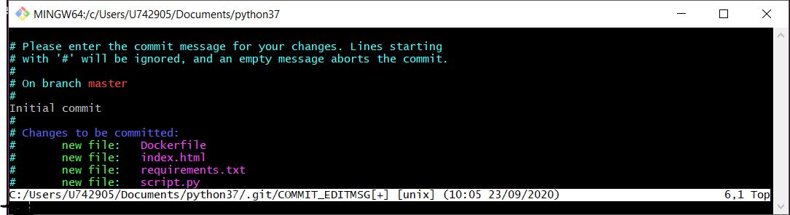

<h2>Version Control with Git and GitHub</h2>

<h3>Intro</h3>
<ul>
  <li>Distributed version control system.</li>
  <li>Coordinates work between multiple developers.</li>
  <li>To see who made what changes and when.</li>
  <li>Revert back in time.</li>
  <li>Local and remote repos.</li>
</ul>

<h3>Git application</h3>
<ul>
  <li>Keeps track of code histor.</li>
  <li>Takes snapshot of your files at a time.</li>
  <li>You decide when to take a snapshot by making a commit.</li>
  <li>You can visit any snpashot back in time.</li>
  <li>You can stage files before committing.</li>
  <li>Git indicates there is need to get files staged after every change.</li>
</ul>

<h3>Repository</h3>
<ul>
  <li>Git stores the full history and source control of a project over time.</li>
  <li>Can be hosted on local computer or on a shared server like GitHub</li>
  <li>Contributors wokring on the project make  copies of the repository on their local mnachines using the push and pull commands.</li>
  <ul>
    <li><b>remote repository</b> --> shared server repository f.e.: GitHub</li>
    <li><b>local repository</b> --> local machine repository</li>
  </ul>
</ul>

<h3>Workflow</h3>

Working directory <b>-- GIT ADD --></b> Staging Area <b>-- GIT COMMIT --></b> Repository

<h3>Git on Windows 10</h3>
<ul>
  <li>Running Git Bash.</li>
  <li>Go to project folder with <b>cd</b> command.</li>
  <li>Create project files as needed with <b>touch</b> command</li>
  <li>Initialize directory as git repository with <b>git init</b> command:
     
    - it creates .git hidden folder in the current directory
  </li>
  <li>Create user:
     
    - git config --global user.name 'Artur Skrzeta' 
    - git config --global user.email 'arturskrzeta@gmail.com'
  </li>
  <li>Adding a file to stage:
     
    - git add script.py
  </li>
  <li>Checking what is in the stage:
     
    - git status
  </li>
  <li>Removing files from the stage:
     
    - git rm --cached script.py
  </li>
  <li>Adding all files to stage:
     
    - git add . 
    - it commits whole directory paths as well
  </li>
  <li>Committing staged files:
     
    - git commit 
    - it opens a new bash window: type 'i' for inserting, 'esc' keyboar for escaping inserting mode, ':wq' for writing and quitting
     
     
    
  </li>
  <li>Committing staged files with commentary:
     
    - git commit -m 'changed script.py'
  </li>
  <li>Setting a file as ignored to prevent from staging and committing:
     
    - touch .gitignore 
    - in .gitignore type file name to be ingored along with an extension f.e.: index.html 
    - in .gitignore type while directory f.e.: /dir2 
    - .gitignore will be staged and committed as well
  </li>
</ul>

<h3>Branches</h3>
<ul>
  <li>Commiting changes to project aside wwithout affecting main branch.</li>
  <li>Creating a new branch:
     
    - git branch new_branch
  </li>
  <li>Switching branches:
     
    - git checkout new_branch 
     
    
  </li>
  <li>Getting back to master branch makes files created on new_branch disappear:
     
    - git checkout master 
     
    
  </li>
</ul>

<h3>Installation and commands in Ubuntu terminal (Github)</h3>
<ul>
  <li><b>sudo apt-get install git -y</b></li>
  <li><b>git --version</b></li>
  <li><b>git config --global user.name "ArturSkrzeta"</b></li>
  <li><b>git config --global user.email "arturskrzeta@gmail.com"</b></li>
  
  <li><b>git config --list</b>
   
  - shows all the configuration you provide
  </li>
  
  <li><b>ls -al</b>
   
  - shows all files
  - we can find .gitconfig file that stores all the configuration in home directory.
  </li>
  
  <li><b>gedit .gitconfig</b>
   
  - opens gitconfig file
  </li>
  
  <li><b>mkdir git_workspace</b></li>
  <li><b>cd git_workspace</b></li>
  
  <li><b>git init or git clone https://github.com/ArturSkrzeta/BeautifulSoup-for-Web-Scraping.git</b>
   
  - init for initializing new repository (locally)
  - clone for copying repository from GitHub
  </li>
  
  <li><b>touch script.py</b></li>
  <li><b>gedit script.py</b></li>
  
  <li><b>git status</b>
   
  - gives repository status
  - it shows that one files has to be added to git
  </li>
  
  <li><b>git add script.py</b>
   
  - adding a file to a git
  </li>
  
  <li><b>git add .</b>
   
  - adding all files in working directory
  </li>
  
  <li><b>git rm -f script.py</b>
   
  - removing file from staging area
  </li>
  
  <li><b>git status</b>
   
  - it shows there are changes to commit 
  </li>
  
  <li><b>git commit -m "First Python application" script.py</b>
   
  - dash m gives allows to provide command
  - in this case comment to the commit added 
  </li>
  
  <li><b>git push -u origin master</b>
   
  - pushing file into GitHub account
  - it requires your GitHub credentials
  </li>
  
  <li><b>git log</b>
   
  - lists all commits with dates
  </li>
  
</ul>
